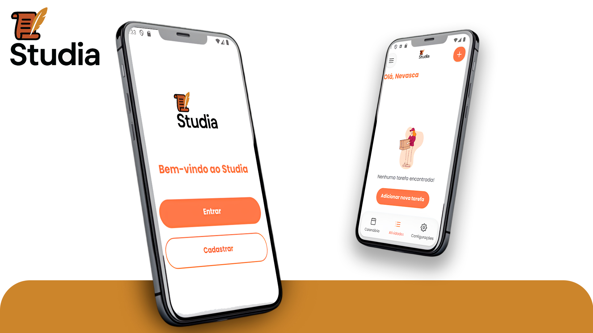

# Título do Projeto

Aplicativo completo com integração com banco de dados **Supabase**, cuja proposta é auxiliar os alunos nos estudos, permitindo organizar tarefas e prazos, acompanhar o desempenho acadêmico e melhorar a comunicação entre alunos e professores.

📄 **Confira a documentação aqui:**  
[Documentação do Projeto](./docstudia.pdf)

---

Projeto realizado no **terceiro ano do Ensino Médio**, integrado ao **Técnico em Informática**, pela equipe:

- Luccas Flores  
- Leticia Bremen  
- Enzo Zaffaroni  
- Rafael Haintz
